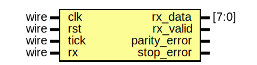

# Entity: uart_rx_fsm 
- **File**: rx.v

## Diagram

## Ports

| Port name    | Direction | Type  | Description               |
| ------------ | --------- | ----- | ------------------------- |
| clk          | input     | wire  |                           |
| rst          | input     | wire  |                           |
| tick         | input     | wire  | tick from baude generator |
| rx           | input     | wire  | serialized data in        |
| rx_data      | output    | [7:0] | parallel data             |
| rx_valid     | output    |       | vaild byte flag           |
| parity_error | output    |       | error check  parity       |
| stop_error   | output    |       | stop bit error            |

## Signals

| Name             | Type      | Description                       |
| ---------------- | --------- | --------------------------------- |
| state = IDLE     | reg [2:0] |                                   |
| sample_count = 0 | reg [3:0] | for the oversampling proccess     |
| bit_index = 0    | reg [3:0] |                                   |
| data_buffer = 0  | reg [7:0] | where the recived bits be stored? |
| received_parity  | reg       | wbu recived parity for checking?  |

## Constants

| Name   | Type | Value  | Description                      |
| ------ | ---- | ------ | -------------------------------- |
| IDLE   |      | 3'b000 |                                  |
| START  |      | 3'b001 | start bit state                  |
| DATA   |      | 3'b010 | data bits state                  |
| PARITY |      | 3'b011 | parity in                        |
| STOP   |      | 3'b100 |                                  |
| DONE   |      | 3'b101 | rise vaild flag, go back to IDLE |

## Processes
- unnamed: ( @(posedge clk or posedge rst) )
  - **Type:** always

## State machines

- wbu recived parity for checking?