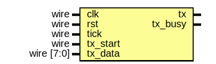
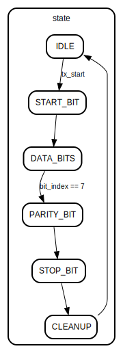

# Entity: uart_tx_fsm 
- **File**: tx.v

## Diagram

## Ports

| Port name | Direction | Type       | Description               |
| --------- | --------- | ---------- | ------------------------- |
| clk       | input     | wire       | obv                       |
| rst       | input     | wire       | async rst                 |
| tick      | input     | wire       | Baud tick from generator  |
| tx_start  | input     | wire       | start flag                |
| tx_data   | input     | wire [7:0] | data in                   |
| tx        | output    |            | seralized data out        |
| tx_busy   | output    |            | busy working on data flag |

## Signals

| Name         | Type      | Description                                 |
| ------------ | --------- | ------------------------------------------- |
| state = IDLE | reg [2:0] |                                             |
| data_reg     | reg [7:0] | reg for storing data and shifting operation |
| parity_bit   | reg       |                                             |
| bit_index    | reg [3:0] | bit index track                             |

## Constants

| Name       | Type | Value  | Description                            |
| ---------- | ---- | ------ | -------------------------------------- |
| IDLE       |      | 3'b000 |                                        |
| START_BIT  |      | 3'b001 |                                        |
| DATA_BITS  |      | 3'b010 |                                        |
| PARITY_BIT |      | 3'b011 |                                        |
| STOP_BIT   |      | 3'b100 |                                        |
| CLEANUP    |      | 3'b101 | changing busy flag and go back to IDLE |

## Processes
- unnamed: ( @(posedge clk or posedge rst) )
  - **Type:** always

## State machines

- bit index track